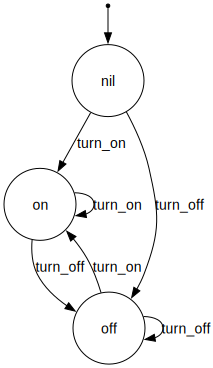

# StateMachines::Graphviz

This adds support for generating di-graphs based on the
events, states, and transitions defined for a state machine using [GraphViz](http://www.graphviz.org).

## Installation

Add this line to your application's Gemfile:

    gem 'state_machines-graphviz' , group: :development

And then execute:

    $ bundle

Or install it yourself as:

    $ gem install state_machines-graphviz

## Usage

The default output folder for the images is `doc/state_machines`.

#### Examples

To generate a graph for a specific file / class:

```bash
rake state_machines:draw FILE=vehicle.rb CLASS=Vehicle
```
From a Rails app directory:

```bash
rake state_machines:draw CLASS=Vehicle
```

To save files to a specific path:

```bash
rake state_machines:draw FILE=vehicle.rb CLASS=Vehicle TARGET=files
```

To customize the image format / orientation:

```bash
rake state_machines:draw FILE=vehicle.rb CLASS=Vehicle FORMAT=jpg ORIENTATION=landscape
```

See http://rdoc.info/github/glejeune/Ruby-Graphviz/GraphViz/Constants for the list of
supported image formats.  If resolution is an issue, the svg format may offer
better results.

To generate multiple state machine graphs:

```bash
rake state_machines:draw FILE=vehicle.rb,car.rb CLASS=Vehicle,Car
```

To use human state / event names:

```bash
rake state_machines:draw FILE=vehicle.rb CLASS=Vehicle HUMAN_NAMES=true
```

**Note** that this will generate a different file for every state machine defined
in the class.  The generated files will use an output filename of the format
`#{class_name}_#{machine_name}.#{format}`.

For examples of actual images generated using this task, see those under the
examples folder.

#### Example output

Generate the sample diagram used in this README:

```bash
bundle exec ruby script/generate_example.rb
```



### Interactive graphs

Jean Bovet's [Visual Automata Simulator](https://github.com/NimaGhaedsharafi/VAS)
is a great tool for "simulating, visualizing and transforming finite state
automata and Turing Machines".  It can help in the creation of states and events
for your models.  It is cross-platform, written in Java.

## Contributing

1. Fork it ( https://github.com/state-machines/state_machines-graphviz/fork )
2. Create your feature branch (`git checkout -b my-new-feature`)
3. Commit your changes (`git commit -am 'Add some feature'`)
4. Push to the branch (`git push origin my-new-feature`)
5. Create a new Pull Request
